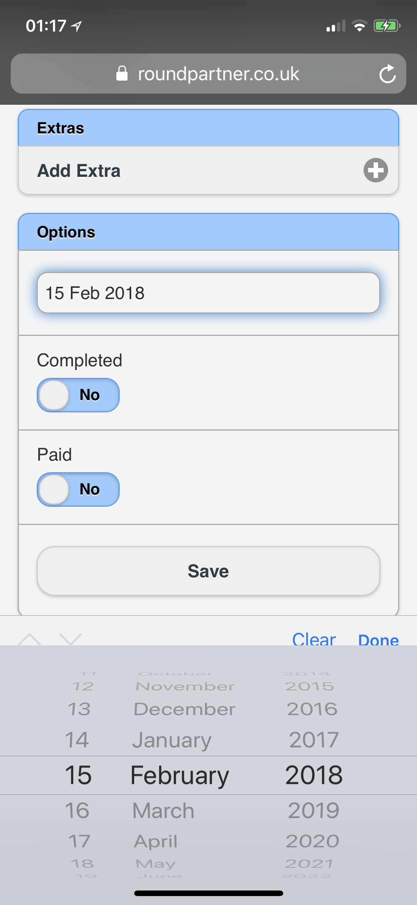

# Schedule Booking
On the desktop site you can change the scheduled date of a job from the job listing.

Press the pencil icon to edit the booking

On the mobile site you can select the job from the listing

Select the date field and then modify the date.
Then press save to reschedule the job.

