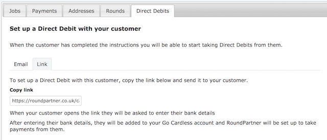

# Direct Debits with Go Cardless
[Go Cardless](https://gocardless.com/) enables you to set up Direct Debits with your customers.

RoundPartner can be connected to Go Cardless allowing you to automatically collect payments from your customers.
When a payment is collected, your customers balance will be updated in RoundPartner and the job marked as paid.

## Set up a Direct Debit
From the [customer](https://roundpartner/customer) section, open the customer you want to set up a Direct Debit for.

Below the customer details you will see a section for Direct Debits.

You can either Email the instructions to set up a Direct Debit to your customer or share them a link.
To Email the instructions, you need to add an Email address to your customer details.

To send them a link, select the link tab.
Copy the link provided and share that with your customer.

The link is unique to your customer so that after they have followed the instructions then their Direct Debit will be linked to their details in RoundPartner.

When your customer opens the link in the email or the link you sent them they will be redirected to Go Cardless to enter their details.
The page will look like below where your account name would be shown instead of RoundPartner.

When the customer has completed their details, the Direct Debit will be linked back to RoundPartner.
