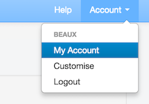
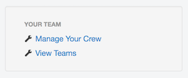
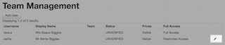
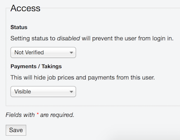
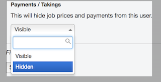
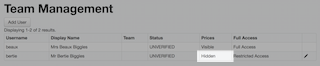

# Setting User Access
You can modify user access by going to my account and then select __manage team__.

Under my account go to __manage your crew__.

Select the pencil icon to edit the user.

When editing the user, under access you can modify what access the user has to RoundPartner.

Select hidden from the drop down menu to hide payments.

Payments will now be hidden from the user.

